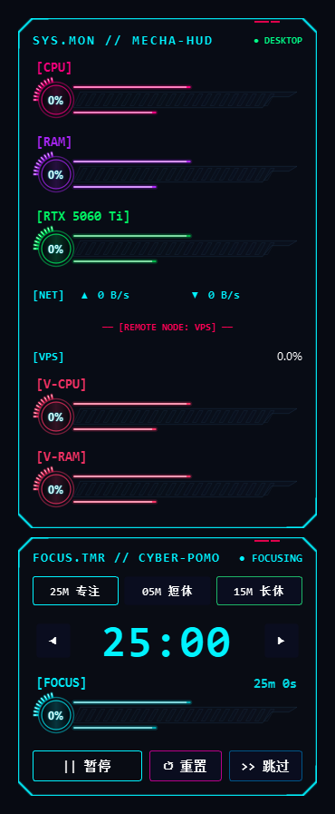

<div align="center">

# ⚡ CyberHUD (赛博机甲桌面监视器 & 专注番茄钟)

**A Futuristic Cyberpunk Mecha Desktop Hardware Monitor & Focus Pomodoro Widget for Windows**

*置底壁纸级 · 赛博装甲风 · 硬件与云主机全维监控 · 沉浸式机甲番茄钟*

[](https://www.python.org/)
[](https://riverbankcomputing.com/software/pyqt/)
[](https://www.microsoft.com/windows)
[](https://github.com/pzx0913-code/CyberHUD/releases/tag/v1.0.0)
[](LICENSE)

<br/>

[👉 **【点击立即下载 v1.0.0 Windows 便携免安装版 ZIP】**](https://github.com/pzx0913-code/CyberHUD/releases/download/v1.0.0/CyberHUD-v1.0.0-windows-x64.zip)

<br/>




</div>

---

## 📖 目录 / Table of Contents
- [✨ 项目亮点 / Highlights](#-项目亮点--highlights)
- [🖥️ 核心功能模块 / Features](#️-核心功能模块--features)
  - [1. 赛博装甲视觉 (Cyberpunk HUD Visuals)](#1-赛博装甲视觉-cyberpunk-hud-visuals)
  - [2. 全维度硬件监控 (Hardware Telemetry)](#2-全维度硬件监控-hardware-telemetry)
  - [3. 远程 VPS 探针 (Remote Server Monitor)](#3-远程-vps-探针-remote-server-monitor)
  - [4. 机甲专注番茄钟 (Cyber Pomodoro Widget)](#4-机甲专注番茄钟-cyber-pomodoro-widget)
  - [5. 深度 Windows 桌面融合 (Desktop Integration)](#5-深度-windows-桌面融合-desktop-integration)
- [🚀 快速开始 / Quick Start](#-快速开始--quick-start)
  - [方式 A：使用独立便携可执行程序 (.exe)](#方式-a使用独立便携可执行程序-exe)
  - [方式 B：从源码运行 (Run from Source)](#方式-b从源码运行-run-from-source)
- [⚙️ 配置说明 / Configuration](#️-配置说明--configuration)
- [📦 打包发布 / Build to Executable](#-打包发布--build-to-executable)
- [📁 项目目录结构 / Architecture](#-项目目录结构--architecture)
- [📄 开源协议 / License](#-开源协议--license)

---

## ✨ 项目亮点 / Highlights

**CyberHUD** 是一款专门为极客、程序员、数字游民和科幻桌面爱好者打造的 Windows 原生桌面监视器与效率工具。

- **壁纸级置底不挡视线**：采用 Windows Win32 底层 API (`HWND_BOTTOM`) 锁定于最底层桌面壁纸层，无论打开任何全屏网页、IDE 或 3A 游戏，悬浮窗均绝不遮挡视线。
- **永久鼠标穿透 (Click-Through)**：支持开启 Windows 扩展样式 `WS_EX_TRANSPARENT`，在悬浮窗区域随意框选图标、点击文件，完全不误触、不挡手。
- **双窗联动·机甲番茄钟**：主 HUD 面板下方无缝磁吸锁定专属“专注番茄钟”，配备 45° 赛博切角几何轮廓、波形律动与极客像素图标，助你深度沉浸工作流。
- **零外部大型依赖引擎**：纯 PyQt6 + QPainter 逐帧矢量绘制，极低 CPU 及内存占用，平滑双缓冲渲染彻底告别屏幕频闪。

---

## 🖥️ 核心功能模块 / Features

### 1. 赛博装甲视觉 (Cyberpunk HUD Visuals)
- **45° 切角几何边框**：工业机甲风硬朗外壳、装饰铆钉刻线、角标与微光呼吸光晕。
- **文字线条纯净高亮**：文字、数字、动态波形曲线与分段刻度条 100% 保持高亮清晰，底板支持 0%（全透纯线条）~ 90%（半透磨砂黑）多档位实时调节。
- **动态曲线图谱 (Cyber Wave)**：内置高灵敏度 CPU / 性能历史波动折线流，渐变填充与动态网格基线渲染。

### 2. 全维度硬件监控 (Hardware Telemetry)
- **CPU**：总体占用率百分比 + 实时动态折线图 + 分段动态能量条。
- **内存 (RAM)**：已用 / 总容量直读（如 `8.0G / 31.8G`）+ 精确百分比刻度。
- **显卡 (GPU)**：通过 NVIDIA 官方驱动级 NVML C-API 直读，支持 GeForce RTX 50/40/30 系列及各类主流显卡，实时监控核心占用率与温度（低温青蓝、中温橙金、高温报警红）。
- **网络 (NET)**：多网卡自适应动态流速采样，上下行网速自动换算显示（`▲ 上行` / `▼ 下行`，支持 B/s、KB/s、MB/s、GB/s）。

### 3. 远程 VPS 探针 (Remote Server Monitor)
- 支持对远程 Linux 服务器 / 云主机状态的实时无缝监控。
- **SSH 探针直连**：基于 Paramiko 轻量直读远程主机 CPU、内存占用率与连接延迟。
- **HTTP 探针模式**：支持配合自带的轻量级 `vps_agent` 极速拉取服务器指标。

### 4. 机甲专注番茄钟 (Cyber Pomodoro Widget)
- **多阶段循环管理**：支持 **FOCUS (专注)**、**SHORT BREAK (短休)**、**LONG BREAK (长休)** 循环阶段。
- **极简调节按键**：时间两侧提供左右微调键，在未开始前可按单次 ±1 分钟快速调整倒计时目标，专注启动后自动锁定防误触。
- **赛博终端状态标识**：
  - 专注模式：`>_` 终端光标极客标识
  - 短休模式：`~C~` 能量咖啡极客标识
  - 长休模式：`*zZ*` 深度休眠极客标识
- **声学提醒**：专注结束时通过 Windows 平台原生音频播放蜂鸣提示音。
- **磁吸锁定**：自动精准贴合在主 HUD 底部，亦可解绑独立拖拽。

### 5. 深度 Windows 桌面融合 (Desktop Integration)
- **系统托盘全能控制**：
  - 🚀 **开机登录自动启动**：一键切换 Windows 登录自启动。
  - 🎯 **调整窗口位置 (临时解锁拖动 15 秒)**：移动到心仪位置后自动锁定并恢复鼠标穿透。
  - 🌓 **底板透明度调节**：90%、65%、45%、25%、0%（全透）。
  - 🍅 **番茄钟独立显隐与重置**。
  - ❌ **安全退出**。

---

## 🚀 快速开始 / Quick Start

### 方式 A：使用独立便携可执行程序 (.exe)
1. 从 [GitHub Releases 页面](https://github.com/pzx0913-code/CyberHUD/releases/tag/v1.0.0) 下载最新版 `CyberHUD-v1.0.0-windows-x64.zip` 并解压到任意目录（例如 `D:\AI\CyberHUD`）。
2. 解压后包含：
   - `CyberHUD.exe`：主程序
   - `config.json`：配置文件
   - `app_icon.ico`：应用图标
   - `使用说明.txt`：新手说明书
3. 双击 `CyberHUD.exe` 即可运行！可在系统托盘右键菜单开启“开机自启”。


### 方式 B：从源码运行 (Run from Source)

#### 环境要求
- Windows 10 / 11 64-bit
- Python 3.10+

#### 1. 克隆仓库
```bash
git clone https://github.com/pzx0913-code/CyberHUD.git
cd CyberHUD
```

#### 2. 安装依赖
```bash
pip install -r requirements.txt
```

#### 3. 运行程序
```bash
# 控制台调试运行
python main.py

# 或静默无黑框运行
pythonw main.py
```

---

## ⚙️ 配置说明 / Configuration

配置文件为根目录下的 `config.json`，支持自定义布局、颜色主题与远程服务器连接：

```json
{
    "window": {
        "x": 2225,
        "y": 225,
        "width": 330,
        "always_on_top": false,
        "locked": false,
        "opacity": 1.0,
        "magnetic_snap": true,
        "click_through": true,
        "stay_on_bottom": true,
        "bg_opacity": 0.45
    },
    "theme": {
        "primary_color": "#00F3FF",
        "secondary_color": "#FF0055",
        "warning_color": "#FFB800",
        "success_color": "#00FF88",
        "bg_color": "#0B0E17",
        "border_glow": true,
        "font_family": "Consolas"
    },
    "hardware": {
        "refresh_interval_ms": 1000,
        "history_points": 35
    },
    "vps": {
        "enabled": true,
        "collapsed": false,
        "refresh_interval_s": 4,
        "type": "ssh",
        "host": "your-vps-ip",
        "port": 22,
        "username": "root",
        "auth_type": "password",
        "password": "your-password",
        "name": "VPS-NODE-01"
    },
    "pomodoro": {
        "enabled": true,
        "locked": true,
        "auto_dock": true,
        "focus_min": 25,
        "short_break_min": 5,
        "long_break_min": 15,
        "sound_alert": true
    }
}
```

> **安全提示**：请勿将包含您真实云服务器密码的 `config.json` 提交到公开代码仓库！

---

## 📦 打包发布 / Build to Executable

如果你希望基于源码自行打包单文件或无控制台的 `.exe` 可执行程序，可以使用 `pyinstaller`：

```bash
# 安装 PyInstaller
pip install pyinstaller

# 一键打包命令
pyinstaller --noconsole --onefile --name "CyberHUD" --icon="app_icon.ico" main.py
```

打包完成后，可执行文件将生成于 `dist/CyberHUD.exe`。只需将同级目录的 `config.json` 与 `app_icon.ico` 放置于同目录下即可独立便携运行。

---

## 📁 项目目录结构 / Architecture

```text
CyberHUD/
├── core/                        # 核心监控与系统逻辑
│   ├── autostart.py             # Windows 开机自启管理
│   ├── config_manager.py        # 配置热载入与持久化
│   ├── local_monitor.py         # 本机 CPU/RAM/GPU/Network 采集线程
│   └── vps_monitor.py           # 远程 VPS SSH/HTTP 探针线程
├── ui/                          # 用户界面与交互层
│   ├── widgets/                 # 赛博机甲风自绘控件
│   │   ├── cyber_bar.py         # 分段能量刻度条
│   │   ├── cyber_mech_bar.py    # 装甲槽能量进度条
│   │   ├── cyber_net_row.py     # 双向网速流量行
│   │   ├── stat_row.py          # 键值对监控信息行
│   │   └── wave_chart.py        # 实时动态波形折线图
│   ├── cyber_painter.py         # 45° 赛博切角几何装甲绘制引擎
│   ├── hud_window.py            # 主 HUD 硬件监控悬浮窗
│   └── pomo_window.py           # 赛博机甲专注番茄钟浮窗
├── vps_agent/                   # 部署在远程 VPS 上的轻量 HTTP 采集探针
│   └── mini_agent.py
├── docs/                        # 项目说明配图与资源
│   └── preview.png
├── app_icon.ico                 # 应用程序与托盘图标
├── config.json                  # 全局预设配置文件
├── main.py                      # 应用主入口
├── requirements.txt             # Python 依赖清单
├── start_hud.bat                # 调试启动脚本
├── start_hud_silent.vbs         # 静默无控制台黑框启动脚本
└── README.md                    # 项目文档
```

---

## 📄 开源协议 / License

本项目采用 [MIT License](LICENSE) 授权许可。欢迎提交 Issue、PR 或 Fork 进行个性化改造！
